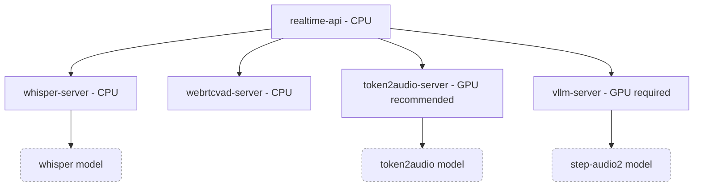

# Step Realtime API Server

Step Realtime API Server 是一款本地化部署的实时 端到端语音服务端，兼容 OpenAI Realtime API Beta 接口规范，内置语音识别（ASR）、语音活动检测等能力（VAD），专为端到端语音模型（step-audio-2-mini）打造，主打超低延迟的实时语音交互体验。

特性

- 支持端到端语音模型 step-audio-2-mini，超低延迟
- 提供 OpenAI Realtime API Beta 版兼容接口
- 完全本地化，内置 Whisper ASR，WebRTC VAD, Token2Audio Server
- 完善的 tracelog 日志，playground ui 工具
- 内置文档

## 开发中能力

- function call 支持
- silero vad 支持
- reasoning 模型支持
    - step-audio-2-mini-think
    - step-audio-r1

## 架构

本项目运行时需要以下服务:

| 服务 | 默认端口 | 说明 |
|------|------|------|
| Realtime API Server | 7777 | 主服务，提供 OpenAI 兼容的 Realtime API，CPU 环境运行 |
| WebRTC VAD Server | 7778 | 语音活动检测服务，CPU 环境运行 |
| Whisper Server | 7779 | 语音识别服务 (ASR)，可在 CPU/GPU 环境运行 |
| Token2Audio Server | 7780 | 文本转语音服务，可在 CPU/GPU 环境运行，极其推荐适用 GPU，若不配置将不会有声音生成 |
| vLLM Server | 7781 | LLM 推理服务，需要运行在 GPU 环境中 |

依赖模型：
- step-audio2 模型（vllm-server）：modelscope or huggingface，需要预先下载。
- whisper 模型 （whisper-server）：如果用预编译可执行文件版本，内置了 base 模型，可通过 api 下载。

## 安装与运行

可以通过以下方式启动各服务：

vLLM Server: 通过源码运行, 通过Docker运行

Token2Audio Server: 通过二进制运行, 通过源码运行, 通过Docker运行

Webrtcvad Server: 通过二进制运行, 通过源码运行, 通过Docker运行

Whisper Server: 通过二进制运行, 通过源码运行, 通过Docker运行

Realtime API: 通过二进制运行, 通过源码运行, 通过Docker运行
